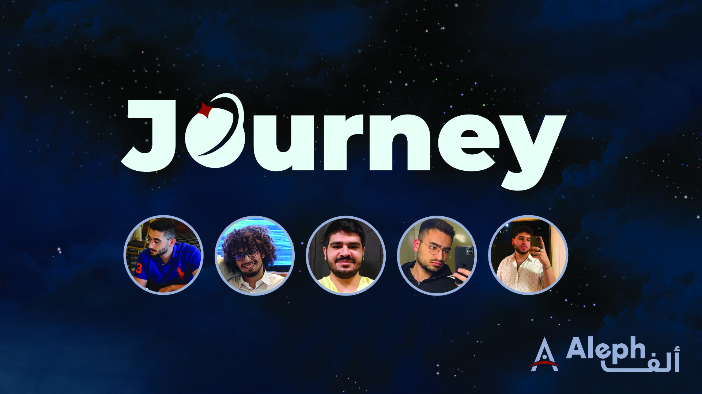

[Link to finished website](https://journey-b5m9.onrender.com/)

    

## High-Level Summary

In this project we propose “Journey”, a web App that helps space tourists discover planets, in an educational and entertaining way. Journey shows our planets, with their perspective hotspots, special characteristics and fun facts in an interactive and visually appealing way. Journey literally takes you on a journey through our solar system, informing you about every detail. Journey's distinctive feature is “Rocket” an AI powered chatbot companion, that answers your questions in a friendly, highly researched manner.

## Project Demo

[https://youtu.be/iquQJu46X68](https://youtu.be/iquQJu46X68)

## Project Details

    

### What Does It Do?

The backend handles the **ChatGPT API calls** we need for the website and stores the data in MySQL. It sends the necessary JSON data to the frontend using axios.

Our frontend receives the backend data using axios and displays them accordingly to the user.

### How does it stand out?

Our challenge was to create a tool that will not only develop customized recommendations to help you organize **your trip to space**, but also to paint a clearer image of the main bodies in our solar system. Let it be Mars, Jupiter or even Saturn. This tool will also **educate** present-day users about the diverse **beauty of space**.

**_Journey_**, accessed [here](https://journey-b5m9.onrender.com/), is an educational **Web App** that can be used as a means of **education**, as well as an outlet for **entertainment**. This tool not only showcases all you need to know about our planets, in a visually **appealing way**, but also works on informing the public on interesting and fun occurring phenomenon and characteristics of said planets.

The interactive **AI chatbot _"Rocket"_** makes communicating and asking questions more interactive and direct. Rocket will share information in a **friendly** and **researched** approach, to help all users understand space and get excited about visiting it.

### How does it work?

**Three.js** is a JavaScript library that allows you to manipulate **3D objects** directly in your browser by allowing you to use **WebGL** in an **HTML5** canvas.

WebGL is a JavaScript API that allows you to create 2D and 3D graphic rendering.

This means you can use Three.js to render a simple **model** on your site from your server, but also allow users to interact with something much more complex on the same site if their specs allow for it.

### What benefits deos it have?

We aim to provide a **stimulating tour** of a collection of planets in a manner that can be used by more than one group. Future astronauts can use this to get a quick **briefing** of a location before they visit it, while scientists can use it as a **hub** of info they can use to get to more **detailed sources**. And generally, it can be used by the public to get **educated and entertained**, and hopefully **make plans** to visit the planets they learn about.

### What do we hope to achieve?

The ultimate **goal** of our project is to make an interesting **showcase of planets**, not necessarily of our solar system, but also of the universe as a whole. Due to time limitations, we couldn't do a full tour of some of the more fascinating planets in our solar system, however our project serves as more of a foundation for the idea we had in mind.

### What tools did we use?

Our backend uses _Django_, which is a _Python_ backend library and stores the data in _MySQL_.

We used _React.js_ and _Three.js_ for the frontend of our web app.

We used a lot of _open source data_, mostly from the NASA website.

We also used Adobe apps such as _Illustrator_ and _Photoshop_.

Furthermore, we hosted it on render.com Individual plan and our database on railway.app

One of our member's python requirements:

- django-cors-headers
- django
- djangorestframework
- markdown
- django-filter
- openai
- python-dotenv
- mysqlclient
- gunicorn
- whitenoise
- Brotli
- django-http-referrer-policy

#### Use of Artificial Intelligence

Yes, our website integrates OpenAI's ChatGPT as our friendly companion “Rocket”. It is a really powerful tool that elevates the functionality and accessibility of our website, while maintaining the fun and informative environment we developed.
Space Agency Data
